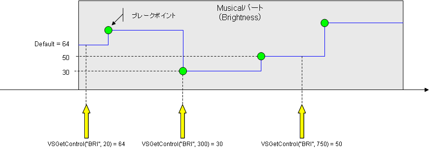

# Obtaining and editing control parameters
## Type and Constant Definitions of the table to use
Table type to be used in the Editing and API acquisition of control parameters and following shows the definition of the constant.

```cpp
// Type of control parameter (string).
// "DYN": Dynamics
// "BRE": Bureshinesu
// "BRI": Brightness
// "CLE": Clearnes
// "GEN": Gender factor
// "PIT": Pitch
// "PBS": Pitch Bend Sensitivity
// "POR": Portamento timing
// Control parameters breakpoint type 
struct VSLuaControl {
    VSInt32 posTick; // Position of the control parameters breakpoint.
    VSInt32 value; // Value of the control parameter breakpoint.
    VSCString type; // Type of control parameters.
};

```


## The random access method specified by the time
Control parameter, has existed as a break point that is located discretely on the time axis is implementation, but I have a property to change continuously with respect to the time axis in concept. In this case, the access method of the data, it is likely than the access method, and easy to understand more of the random access method specified by the time more intuitive sequential like note.

Therefore, for the control parameters, and to be introduced by the random access method specified by time.

The figure below shows an example of using the method of this. The value of the control parameters, because between the break point and break point are interpolated by a straight line in the manner shown in the figure below, the value is always present at the time of any part in the Musical. For this reason, random access method specified by time is possible.


- If you specify a time before the first break point API returns the default value of the control parameter.
- If you specify the time of the break point on API returns the value of the break point.
- If the break point-to-point and specify a time after the end breakpoint
image

API returns the value of the break point of the maximum time that existed before that time.

## The random access method specified by the time


<center>The random access method specified by the time</center>


- VSBool result, VSInt32 value VSGetControlAt(VSCString controlType, VSInt32 posTick)

I get the value of the control specified parameters of the specified time of the Musical Part.

```cpp
// I get the control parameters.
// Parameters:
// controlType: Type of control parameters to be retrieved.
// posTick: Time of control the parameter to retrieve.
// Time in units of Tick in a 0 for the first part.
// Return value:
// result: When acquisition is successful VS_TRUE, When the error VS_FALSE.
// value: Value of the control parameter.
VSBool result, VSInt32 value VSGetControlAt(VSCString controlType, VSInt32 posTick);
```


- VSBool VSUpdateControlAt(VSCString controlType, VSInt32 posTick, VSInt32 value)

I will update the value of the control specified parameters of the specified time of the Musical Part.


```cpp
// I will update the value of a control parameter.
// Parameters:
// controlType: Type of control parameters to be retrieved.
// posTick: Time of control the parameter to retrieve.
// Time in units of Tick in a 0 for the first part.
// value: Value of the control parameter to be updated.
// Return value: When acquisition is successful VS_TRUE, When the error VS_FALSE.
VSBool VSUpdateControlAt( VSCString controlType, VSInt32 posTick, VSInt32 value );
```


## The sequential access method API with Cursor
You may want also want to know for the control parameters, where to find the change point of the value or there. In such a case, better to while examining sequentially from the beginning break point of the control parameters is more efficient.

So, I will have a sequential access API with a cursor also to control parameters.


- VSBool VSSeekToBeginControl(VSCString controlType)

I positioned before one of the first control parameter the specified breakpoints Musical part the cursor.


```cpp
// The first control parameter the specified breakpoints Musical part the cursor
// I positioned one before.
// Parameters:
// controlType: Type of control parameters to be retrieved.
// Return value: When acquisition is successful VS_TRUE, When the error VS_FALSE.
VSBool VSSeekToBeginControl( VSCString controlType );
```


- VSBool result, VSLuaControl control VSGetNextControl(VSCString controlType)

To advance to the control parameters the next breakpoint of the control parameters the specified breakpoints Musical part the cursor to retrieve its value.


```cpp
// To advance to the control parameters breakpoint of the cursor to the next, to get its value.
// Parameters:
// controlType: Type of control parameters to be retrieved.
// Return value:
// result: When acquisition is successful VS_TRUE, When the error VS_FALSE.
// control: Value of the control parameter breakpoint.
VSBool result, VSLuaControl control = VSGetNextControl(VSCString controlType);
```


- VSBool VSUpdateControl(VSLuaControl control)

Update control events in the value of the control event you pass a parameter. Control events that can be passed to the parameter, which must be the ones that you obtained in VSGetNextControl API in advance. In other words, to get the control events in VSGetNextControl, set the value to be updated for the field of the control event, the steps to update the value of a control event by calling the API as a parameter of VSUpdateControl it then.
```cpp
// I will update the value of a control event.
// Parameters: Control events that value to be updated has been set.
// Return value: When acquisition is successful VS_TRUE, When the error VS_FALSE.
VSBool VSUpdateControl( VSLuaControl control );
```
- VSBool VSInsertControl(VSLuaControl control)

Add control events in the value of the control event you pass a parameter. Each field of control events that pass in the parameter must be set with the appropriate values. (You can not omit the field of all.)

```cpp
// I want to add a control event.
// Parameters: Control event to be added.
// Return value: When acquisition is successful VS_TRUE, When the error VS_FALSE.
VSBool VSInsertControl( VSLuaControl control );
```


- VSBool VSRemoveControl(VSLuaControl control)

Remove the control event you pass a parameter. Control events that can be passed to the parameter, which must be the ones that you get in VSGetNextControl () API in advance. In other words, get the control events to be deleted VSGetNextControl in () API, it is the procedure to remove a control event by calling the API as a parameter VSRemoveControl of () API it.


```cpp
// I want to remove a control event.
// Parameters: Delete target control event.
// Return value: When acquisition is successful VS_TRUE, When the error VS_FALSE.
VSBool VSRemoveControl( VSLuaControl control );
```

- Getting default value

VSBool result, VSInt32 value VSGetDefaultControlValue(VSCString controlType) Gets the default value of the control parameter the specified type.

```cpp
// Get the default value of the control parameter the specified type.
// Parameters:
// controlType: Type of control parameters to be retrieved.
// Return value:
// result: When acquisition is successful VS_TRUE, When the error VS_FALSE.
// value: The default value of the control parameter.
VSBool result, VSInt32 value VSGetDefaultControlValue( VSCString controlType );
```


## Sample Program
### ControlSample1.lua
```lua

--
-- ControlSample1.lua
-- コントロールパラメータの取得のサンプル.
--

--
-- Copyright (C) 2011 Yamaha Corporation
--

--
-- プラグインマニフェスト関数.
--
function manifest()
    myManifest = {
        name          = "コントロールパラメータの取得のサンプル",
        comment       = "コントロールパラメータの取得のサンプルJobプラグイン",
        author        = "Yamaha Corporation",
        pluginID      = "{5F2176EE-2B4A-44ea-89B0-B7687085749F}",
        pluginVersion = "1.0.0.1",
        apiVersion    = "3.0.0.1"
    }
    
    return myManifest
end


--
-- VOCALOID3 Jobプラグインスクリプトのエントリポイント.
--
function main(processParam, envParam)
	-- 実行時に渡された処理条件パラメータを取得します.
	local beginPosTick = processParam.beginPosTick	-- 選択範囲の始点時刻（ローカルTick）.
	local endPosTick   = processParam.endPosTick	-- 選択範囲の終点時刻（ローカルTick）.
	local songPosTick  = processParam.songPosTick	-- カレントソングポジション時刻（ローカルTick）.

	-- 実行時に渡された実行環境パラメータを取得します.
	local scriptDir  = envParam.scriptDir	-- Luaスクリプトが配置されているディレクトリパス（末尾にデリミタ "\" を含む）.
	local scriptName = envParam.scriptName	-- Luaスクリプトのファイル名.
	local tempDir    = envParam.tempDir		-- Luaプラグインが利用可能なテンポラリディレクトリパス（末尾にデリミタ "\" を含む）.


	local retCode
	local controlVal = 0
	local controlMin = 128
	local controlMax = 0
	local controlAvg = 0


	-- 選択範囲のダイナミクスコントロールイベントの最大/最小/平均値を求めます.
	for posTick = beginPosTick, endPosTick do
		retCode, controlVal = VSGetControlAt("DYN", posTick)
		
		if (controlVal < controlMin) then
			controlMin = controlVal
		end
		if (controlMax < controlVal) then
			controlMax = controlVal
		end
		
		controlAvg = controlAvg + controlVal
	end
	
	if (beginPosTick < endPosTick) then
		controlAvg = controlAvg / (endPosTick - beginPosTick)
	else
		-- 平均値を求められません.
		controlAvg = -1
	end


	-- 計算結果をメッセージボックスへ表示します.
	local msg
	msg =
		"選択範囲のダイナミクスコントロールイベントの,\n" ..
		"  最大値 = [" .. controlMax ..
		"]\n  最小値 = [" .. controlMin ..
		"]\n  平均値 = [" .. controlAvg ..
		"]\nです."
	VSMessageBox(msg, 0)


	-- 正常終了.
	return 0
end

```
### ControlSample2.lua

```lua

--
-- ControlSample2.lua
-- コントロールパラメータの取得/更新のサンプル.
--

--
-- Copyright (C) 2011 Yamaha Corporation
--

--
-- プラグインマニフェスト関数.
--
function manifest()
    myManifest = {
        name          = "コントロールパラメータの取得/更新のサンプル",
        comment       = "コントロールパラメータの取得/更新のサンプルJobプラグイン",
        author        = "Yamaha Corporation",
        pluginID      = "{A00AF690-A52F-4f3a-AE29-2D6EAE732907}",
        pluginVersion = "1.0.0.1",
        apiVersion    = "3.0.0.1"
    }
    
    return myManifest
end


--
-- VOCALOID3 Jobプラグインスクリプトのエントリポイント.
--
function main(processParam, envParam)
	-- 実行時に渡された処理条件パラメータを取得します.
	local beginPosTick = processParam.beginPosTick	-- 選択範囲の始点時刻（ローカルTick）.
	local endPosTick   = processParam.endPosTick	-- 選択範囲の終点時刻（ローカルTick）.
	local songPosTick  = processParam.songPosTick	-- カレントソングポジション時刻（ローカルTick）.

	-- 実行時に渡された実行環境パラメータを取得します.
	local scriptDir  = envParam.scriptDir	-- Luaスクリプトが配置されているディレクトリパス（末尾にデリミタ "\" を含む）.
	local scriptName = envParam.scriptName	-- Luaスクリプトのファイル名.
	local tempDir    = envParam.tempDir		-- Luaプラグインが利用可能なテンポラリディレクトリパス（末尾にデリミタ "\" を含む）.


	local control = {}
	local controlList = {}
	local controlNum
	local retCode
	local idx


	-- ダイナミクスコントロールイベントを取得します.
	retCode = VSSeekToBeginControl("DYN")
	idx = 1
	retCode, control = VSGetNextControl("DYN")
	while (retCode == 1) do
		controlList[idx] = control
		retCode, control = VSGetNextControl("DYN")
		idx = idx + 1
	end
	controlNum = table.getn(controlList)

	-- 取得したダイナミクスコントロールイベントへゆらぎを付与します.
	local seed = os.time()
	math.randomseed(seed)
	for idx = 1, controlNum do
		local randControl = {}
		randControl = controlList[idx]
		
		randControl.value = randControl.value + math.random()*5.0
		
		retCode = VSUpdateControl(randControl)
	end


	-- 正常終了.
	return 0
end

```
### ControlSample3.lua

```lua

--
-- ControlSample3.lua
-- コントロールパラメータの追加/削除のサンプル.
--

--
-- Copyright (C) 2011 Yamaha Corporation
--

--
-- プラグインマニフェスト関数.
--
function manifest()
    myManifest = {
        name          = "コントロールパラメータの追加/削除のサンプル",
        comment       = "コントロールパラメータの追加/削除のサンプルJobプラグイン",
        author        = "Yamaha Corporation",
        pluginID      = "{98EBB5BE-A7D2-447b-80B8-79603BEA7B79}",
        pluginVersion = "1.0.0.1",
        apiVersion    = "3.0.0.1"
    }
    
    return myManifest
end


--
-- VOCALOID3 Jobプラグインスクリプトのエントリポイント.
--
function main(processParam, envParam)
	-- 実行時に渡された処理条件パラメータを取得します.
	local beginPosTick = processParam.beginPosTick	-- 選択範囲の始点時刻（ローカルTick）.
	local endPosTick   = processParam.endPosTick	-- 選択範囲の終点時刻（ローカルTick）.
	local songPosTick  = processParam.songPosTick	-- カレントソングポジション時刻（ローカルTick）.

	-- 実行時に渡された実行環境パラメータを取得します.
	local scriptDir  = envParam.scriptDir	-- Luaスクリプトが配置されているディレクトリパス（末尾にデリミタ "\" を含む）.
	local scriptName = envParam.scriptName	-- Luaスクリプトのファイル名.
	local tempDir    = envParam.tempDir		-- Luaプラグインが利用可能なテンポラリディレクトリパス（末尾にデリミタ "\" を含む）.


	local control = {}
	local controlList = {}
	local controlNum
	local retCode
	local idx


	-- ダイナミクスコントロールイベントを取得します.
	retCode = VSSeekToBeginControl("DYN")
	idx = 1
	retCode, control = VSGetNextControl("DYN")
	while (retCode == 1) do
		controlList[idx] = control
		retCode, control = VSGetNextControl("DYN")
		idx = idx + 1
	end
	controlNum = table.getn(controlList)

	-- 取得したダイナミクスコントロールイベントを全部削除します.
	for idx = 1, controlNum do
		retCode = VSRemoveControl(controlList[idx])
	end

	-- 取得したダイナミクスコントロールイベントを一定間隔で間引きます.
	-- 平均値のイベントを挿入することで,結果として間引きになります.
	local pos1 = 1
	local pos2
	for pos2 = 2, controlNum do
		local control1 = {}
		local control2 = {}
		control1 = controlList[pos1]
		control2 = controlList[pos2]
		
		local dt = control2.posTick - control1.posTick
		if (32 < dt) then
			local newControl = {}
			newControl.posTick = (control1.posTick + control2.posTick) / 2
			newControl.value   = (control1.value   + control2.value) / 2
			newControl.type    = "DYN"
			retCode = VSInsertControl(newControl)
			pos1 = pos2
		end
	end


	-- 正常終了.
	return 0
end

```

### Delete Selection.lua
```lua

--
-- 選択範囲の削除.
--

--
-- プラグインマニフェスト関数.
--
function manifest()
    myManifest = {
        name          = "Delete Selection",
        comment       = "Delete selected region and shift the folloing events left.",
        author        = "Yamaha Corporation",
        pluginID      = "{6D9E75F9-8167-401c-9A0E-CA6A994F890E}",
        pluginVersion = "1.0.0.1",
        apiVersion    = "3.0.0.1"
    }
    
    return myManifest
end


-- ノートリスト
noteList = {}

-- コントロールパラメータリスト = {}
controlList = {}
controlListMap = {
	{ type = "DYN", controlList = {} },	-- ダイナミクス.
	{ type = "BRE", controlList = {} },	-- ブレシネス.
	{ type = "BRI", controlList = {} },	-- ブライトネス.
	{ type = "CLE", controlList = {} },	-- クリアネス.
	{ type = "GEN", controlList = {} },	-- ジェンダーファクター.
	{ type = "PIT", controlList = {} },	-- ピッチベンド.
	{ type = "PBS", controlList = {} },	-- ピッチベンドセンシティビティー.
	{ type = "POR", controlList = {} }	-- ポルタメントタイミング.
}
controlTypeIDNum = table.getn(controlListMap)


--
-- スクリプトのエントリポイント関数.
--
function main(processParam, envParam)
	-- 実行時に渡されたパラメータを取得する.
	local beginPosTick = processParam.beginPosTick	-- 選択範囲の始点時刻（ローカルTick）.
	local endPosTick   = processParam.endPosTick	-- 選択範囲の終点時刻（ローカルTick）.
	local songPosTick  = processParam.songPosTick	-- カレントソングポジション時刻（ローカルTick）.

	-- 実行時に渡された実行環境パラメータを取得する.
	local scriptDir  = envParam.scriptDir	-- Luaスクリプトが配置されているディレクトリパス（末尾にデリミタ "\" を含む）.
	local scriptName = envParam.scriptName	-- Luaスクリプトのファイル名.
	local tempDir    = envParam.tempDir		-- Luaプラグインが利用可能なテンポラリディレクトリパス（末尾にデリミタ "\" を含む）.

	local startPosTick
	local delDuration
	local note = {}
	local control = {}
	local field = {}
	local noteCount
	local controlCount
	local dlgStatus
	local retCode
	local type
	local idx

	-- パラメータ入力ダイアログのウィンドウタイトルを設定する.
	VSDlgSetDialogTitle("Delete Selection")
	
	-- ダイアログにフィールドを追加する.
	field.name       = "startPosTick"
	field.caption    = "Start time (Tick)"
	field.initialVal = beginPosTick
	field.type       = 0
	dlgStatus = VSDlgAddField(field)
	
	field.name       = "endPosTick"
	field.caption    = "End time (Tick)"
	field.initialVal = endPosTick
	field.type       = 0
	dlgStatus = VSDlgAddField(field)

	-- ダイアログから入力値を取得する.
	dlgStatus = VSDlgDoModal()
	if (dlgStatus == 2) then
		-- When it was cancelled.
		return 0
	end
	if ((dlgStatus ~= 1) and (dlgStatus ~= 2)) then
		-- When it returned an error.
		return 1
	end
	
	-- ダイアログから入力値を取得する.
	dlgStatus, startPosTick = VSDlgGetIntValue("startPosTick")
	dlgStatus, endPosTick  = VSDlgGetIntValue("endPosTick")
	local delDuration = endPosTick - startPosTick

	-- ノートを取得する.
	VSSeekToBeginNote()
	idx = 1
	retCode, note = VSGetNextNote()
	while (retCode == 1) do
		noteList[idx] = note
		retCode, note = VSGetNextNote()
		idx = idx + 1
	end
	noteCount = table.getn(noteList)

	-- 削除区間内のノートを削除する.
	for idx = 1, noteCount do
		if ((startPosTick <= noteList[idx].posTick) and (noteList[idx].posTick <= endPosTick)) then
			VSRemoveNote(noteList[idx])
		end
	end

	-- ノートをシフトする.
	for idx = 1, noteCount do
		if (endPosTick <= noteList[idx].posTick) then
			noteList[idx].posTick = noteList[idx].posTick - delDuration
			VSUpdateNote(noteList[idx])
		end
	end
	
	-- コントロールパラメータを取得する.
	for type = 1, controlTypeIDNum do
		retCode = VSSeekToBeginControl(controlListMap[type].type)
		idx = 1
		retCode, control = VSGetNextControl(controlListMap[type].type)
		while (retCode == 1) do
			controlListMap[type].controlList[idx] = control
			retCode, control = VSGetNextControl(controlListMap[type].type)
			idx = idx + 1
		end
	end
	
	-- 削除区間内のコントロールパラメータを削除する.
	for type = 1, controlTypeIDNum do
		controlCount = table.getn(controlListMap[type].controlList)
		for idx = 1, controlCount do
			if ((startPosTick <= controlListMap[type].controlList[idx].posTick) and
				(controlListMap[type].controlList[idx].posTick <= endPosTick)) then
				VSRemoveControl(controlListMap[type].controlList[idx])
			end
		end
	end

	-- コントロールパラメータをシフトする.
	for type = 1, controlTypeIDNum do
		controlCount = table.getn(controlListMap[type].controlList)
		for idx = 1, controlCount do
			if (endPosTick <= controlListMap[type].controlList[idx].posTick) then
				controlListMap[type].controlList[idx].posTick = controlListMap[type].controlList[idx].posTick - delDuration
				VSUpdateControl(controlListMap[type].controlList[idx])
			end
		end
	end
	
	-- 正常終了.
	return 0
end
```