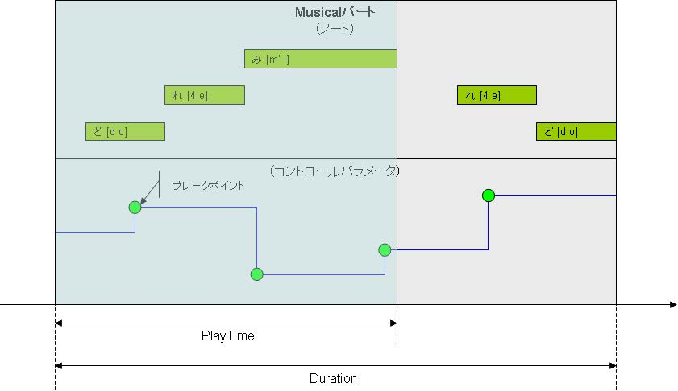

# Obtain and editing of Musical part information
## Definition of table type to use
The following is a table type definition to be used in the editing and API acquisition of Musical part information.

```cpp

// Part type.
struct VSLuaMusicalPart {
    VSInt32 posTick; // Position of the part (Global Tick).
    VSInt32 playTime; // Maximum duration of the part.
    VSInt32 durTick; // Duration of the part.
    VSCString name; // Part name.
    VSCString comment; // Comment.
};


// Virtual Singer type
struct VSLuaMusicalSinger {
    VSInt32 vBS; // Virtual Bank Select
    VSInt32 vPC; // Virtual program change.
    VSCString compID; // Component ID.
    // Sound parameters.
    VSInt32 breathiness; // Bureshinesu
    VSInt32 brightness; // Brightness
    VSInt32 clearness; // Clearness
    VSInt32 genderFactor; // Gender factor
    VSInt32 opening; // Opening
};
```

## About PlayTime And Duration
Including the Musical part, data, which means the length of two PlayTime and Duration will exist in the part. PlayTime Means (Tick) time that is actually played.

Duration means the distance between the end time of the event and the end part time head of the part. Units, Tick the Musical part, For WAV part is Sec. In the figure below, I show the relationship PlayTime and Duration.


<div style="text-align: center;">PlayTime and Duration Relationship</div>


## Information acquisition part of the Musical
- VSBool result, VSLuaMusicalPart part VSGetMusicalPart()

I get the Musical part of the information currently processed.

```cpp
// I get the Musical part of the information currently processed.
// Parameters: None.
// Returns:
// result: When acquisition is successful VS_TRUE, When the error VS_FALSE.
// part: Musical part of the information currently processed.
VSBool result, VSLuaMusicalPart part = VSGetMusicalPart();
```


## Update information of Musical Part
- VSBool VSUpdateMusicalPart(VSLuaMusicalPart part)

Update the Musical part by the value of the Musical part you pass a parameter.

Musical part that can be passed to the parameter, which must be a Musical part that you obtained in VSGetMusicalPart in advance. In other words, set the value to get the Musical part in VSGetMusicalPart, Product will all be updated with respect to that field, the value of the Musical part by calling the API as a parameter of VSUpdateMusicalPart the Re after its its it is the procedure to update.


```cpp
// I will update the Musical part of information currently processed.
// Parameters: Musical Part information to be updated.
// result: When acquisition is successful VS_TRUE, When the error VS_FALSE.
VSBool VSUpdateMusicalPart( VSLuaMusicalPart part );
```


## Virtual Singer information acquisition of the Musical part
- VSBool result, VSLuaMusicalSinger singer VSGetMusicalPartSinger()

I get the information of virtual Singer Musical part of the current process target. Virtual Singer of Musical part is present only always one part Musical.


```cpp
// I get the information of virtual Singer Musical part of the current process target.
// Parameters: None.
// Returns:
// result: When acquisition is successful VS_TRUE, When the error VS_FALSE.
// singer: Virtual Singer Musical part of the information to be processed currently.
VSBool result, VSLuaMusicalSinger singer = VSGetMusicalPartSinger();
```


## Sample program 
### MusicalPartSample.lua
```lua

--
-- Musicalパート情報の取得/更新のサンプル.
--

--
-- Copyright (C) 2011 Yamaha Corporation
--

--
-- プラグインマニフェスト関数.
--
function manifest()
    myManifest = {
        name          = "Musicalパート情報の取得/更新のサンプル",
        comment       = "Musicalパート情報の取得/更新のサンプルJobプラグイン",
        author        = "Yamaha Corporation",
        pluginID      = "{D45979E3-868B-45cc-8E73-8FE92CA59214}",
        pluginVersion = "1.0.0.1",
        apiVersion    = "3.0.0.1"
    }
    
    return myManifest
end


--
-- VOCALOID3 Jobプラグインスクリプトのエントリポイント.
--
function main(processParam, envParam)
	-- 実行時に渡されたパラメータを取得します.
	local beginPosTick = processParam.beginPosTick	-- 選択範囲の始点時刻（ローカルTick）.
	local endPosTick   = processParam.endPosTick	-- 選択範囲の終点時刻（ローカルTick）.
	local songPosTick  = processParam.songPosTick	-- カレントソングポジション時刻（ローカルTick）.

	-- 実行時に渡された実行環境パラメータを取得します.
	local scriptDir  = envParam.scriptDir	-- Luaスクリプトが配置されているディレクトリパス（末尾にデリミタ "\" を含む）.
	local scriptName = envParam.scriptName	-- Luaスクリプトのファイル名.
	local tempDir    = envParam.tempDir		-- Luaプラグインが利用可能なテンポラリディレクトリパス（末尾にデリミタ "\" を含む）.


	local musicalPart   = {}
	local musicalSinger = {}
	local retCode
	local msg


	-- Musicalパート情報を取得します.
	retCode, musicalPart = VSGetMusicalPart()

	-- 取得したMusicalパート情報をメッセージボックスへ表示します.
	msg =
		"取得したMusicalパート情報は,\n" ..
		"  posTick = [" .. musicalPart.posTick ..
		"]\n  playTime = [" .. musicalPart.playTime ..
		"]\n  durTick = [" .. musicalPart.durTick ..
		"]\n  name = [" .. musicalPart.name ..
		"]\n  comment = [" .. musicalPart.comment ..
		"]\nです.続けますか?"
	retCode = VSMessageBox(msg, 4)	-- MB_YESNO
	if (retCode == 7) then			-- IDNO
		-- 「いいえ」を選んだので終了します.
		return 0
	end


	-- MusicalパートのバーチャルSinger情報を取得します.
	retCode, musicalSinger = VSGetMusicalPartSinger()

	-- 取得したバーチャルSinger情報をメッセージボックスへ表示します.
	msg =
		"取得したバーチャルSinger情報は,\n" ..
		"  vBS = [" .. musicalSinger.vBS ..
		"]\n  vPC = [" .. musicalSinger.vPC ..
		"]\n  breathiness = [" .. musicalSinger.breathiness ..
		"]\n  brightness = [" .. musicalSinger.brightness ..
		"]\n  clearness = [" .. musicalSinger.clearness ..
		"]\n  genderFactor = [" .. musicalSinger.genderFactor ..
		"]\n  opening = [" .. musicalSinger.opening ..
		"]\n  compID = [" .. musicalSinger.compID ..
		"]\nです.続けますか?"
	retCode = VSMessageBox(msg, 4)	-- MB_YESNO
	if (retCode == 7) then			-- IDNO
		-- 「いいえ」を選んだので終了します.
		return 0
	end


	-- Musicalパート情報を更新します.
	musicalPart.posTick  = musicalPart.posTick + 1920
	musicalPart.playTime = 3840
	musicalPart.name     =
		musicalPart.name ..
		"[" .. musicalSinger.vBS .. "/" .. musicalSinger.vPC ..
		"@" .. musicalSinger.compID ..
		"]"
	musicalPart.comment  = "このMusicalパートは、Jobプラグインから更新されました。@" .. os.date()
	retCode = VSUpdateMusicalPart(musicalPart)


	-- 正常終了.
	return 0
end

```