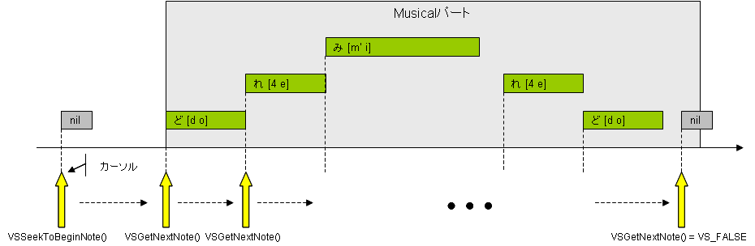

# Get and edit of note events
## Definition of table type to use
The following is a table type definition to be used in the get and editing of note events
```cpp
// Note event type.
struct VSLuaNote {
    VSInt32 posTick; // Note ON time
    VSInt32 durTick; // Note Duration
    VSInt32 noteNum; // Tone
    VSInt32 velocity; // Velocity
    VSCString lyric; // Lyrics
    VSCString phonemes; // Phonetic symbols (It is separated by a space)
    VSBool phLock; // Phonetic protect flag (Optional default: VS_FALSE)
};
```

```cpp
// Note event type, including the facial control parameters.
struct VSLuaNoteEx {
	VSInt32 posTick;  // Note ON time
	VSInt32 durTick;  // Note Duration
	VSInt32 noteNum;  // Tone
	VSInt32 velocity;  // Velocity
	VSCString lyric;  // Lyrics
	VSCString phonemes;  // Phonetic symbols (It is separated by a space)
	VSBool phLock;  // Phonetic protect flag (Optional default: VS_FALSE)
	VSInt32 bendDepth;  // Bend Depth (0 - 100)
	VSInt32 bendLength;  // Bend Length (0 - 100)
	VSBool risePort;  // Addition of portamento flag on line form
	VSBool fallPort;  // Portamento additional flag in the descending form
	VSInt32 decay;  // Decay (0 - 100)
	VSInt32 accent;  // Accent (0 - 100)
	VSInt32 opening;  // Opening (0 - 127)
	// Vibrato length (Percentages rounded to integer)
	VSInt32 vibratoLength;  // Vibrato type (Type of vibrato)
	// 0: Do not offend vibrato
	// 1 - 4: Normal // 5 - 8: Extreme // 9 -12: Fast // 13 - 16: Slight
	VSInt32 vibratoType;
};
```

Here, phLock field was added in API version 3.0.1.0. This is a flag to protect the pronunciation symbol of the note. When you set the VS_TRUE, phonetic symbols of the note will be protected. When you set the VS_FALSE, protection of phonetic symbols of the note is released.
Protection of the phonetic symbols, are from automatic conversion feature of the pronunciation symbols to be executed when you edit the lyrics from VOCALOID3 editor, to protect the phonetic symbols of the note. It is not intended to protect against changes from the Job plug-in. Therefore, from the Job plug-in, you can change the phonetic symbols also to note that this protection is wound. Protected from over The decision to change to note that, you are left to the discretion of the Job plug-in depending on the use of the Job each plugin.

## The sequential access by cursor



<div style="text-align: center;">The sequential access by cursor</div>


Access to the note events can be carried out by sequential access from the Musical part beginning with a cursor. First, VSSeekToBeginNote() By, to position the cursor on the note virtual one before the first note of the Musical Part.

Then, you can VSGetNextNote by () API, and position the cursor to the top notes of Musical part, to get the value of the note. And later, by calling repeatedly VSGetNextNote the () API, you can get to the end notes Musical notes part of the following sequence.

If you call the VSGetNextNote () API to get after the end note of Musical part, this

Returns (0) VS_FALSE, API will only position under the notes virtual behind one of the end note the cursor.

- void VSSeekToBeginNote()

I Position the notes a virtual one before the first notes of the Musical Part cursor.


```cpp
// I positioned one before the first notes of the Musical Part cursor.
// Parameters: None.
// Returns: None.
void VSSeekToBeginNote();
```


- VSBool result, VSLuaNote note VSGetNextNote()

To advance to the next note the cursor, you will get the value of the note.


```cpp
// To advance to the next note the cursor, to get the value of the note.
// Parameters: None.
// Returns:
// result: When acquisition is successful VS_TRUE, When the errorVS_FALSE.
// note: Value of the note.
VSBool result, VSLuaNote note = VSGetNextNote();
```


## Update notes
- VSBool VSUpdateNote(VSLuaNote note)

Update notes the value of the notes that was passed in the parameter.

notes that can be passed to the parameter, which must be a notes that you obtained in VSGetNextNote API in advance. In other words, get a note on VSGetNextNote API, set the value to be updated with respect to the field of the notes, the steps to update the value of the note by calling the API as a parameter of VSUpdateNote API it then.


```cpp
// I will update the value of the notes.
// Parameters: notes that the updated values is set.
// result: When acquisition is successful VS_TRUE, When the error VS_FALSE.
VSBool VSUpdateNote(VSLuaNote note);
```


## Add notes
- VSBool VSInsertNote(VSLuaNote note)

You can add a notes with the value of the note you pass a parameter。

Each field of notes passed in the parameter must be set with the appropriate values. However, it can be omitted phLock field. If omitted, the default value

I will be set (not protect the phonetic symbols) VS_FALSE. It is not possible to omit fields other than phLock.


```cpp
// I add a note.
// Parameters: note to be added.
// Returned value: When acquisition is successful VS_TRUE, then the error VS_FALSE.
VSBool VSInsertNote( VSLuaNote note );
```


## Delete the note
- VSBool VSRemoveNote(VSLuaNote note)

You can remove the note that was passed in the parameter.

note that can be passed to the parameter, not becomes a note must be obtained in advance VSGetNextNote API. It is the procedure that is to say, to get the note Ki Delete all in VSGetNextNote API, to remove the note by calling the API as a parameter of VSRemoveNote API it.
```cpp
// I delete the note.
// Parameters: deleting note.
// Returned value: When acquisition is successful VS_TRUE, then the error VS_FALSE.
VSBool VSRemoveNote(VSLuaNote note);
```


## The API for facial control parameters of the note
- VSBool result, VSLuaNoteEx noteEx VSGetNextNoteEx()
To advance to the next note the cursor, obtain the value of the note, including the facial control parameters of the note.
```cpp
// To advance to the next note the cursor, to get the value of the note, including the facial control parameters.
// Parametrs: None
// Returned value: When acquisition is successful VS_TRUE, then the error VS_FALSE.
// noteEx: Value of the note, including the facial control parameters
VSBool result, VSLuaNoteEx noteEx = VSGetNextNoteEx();
```
- VSBool VSUpdateNoteEx(VSLuaNoteEx noteEx)

It updates the value of the note, including the facial control parameters you pass in the parameter. note that can be passed to the parameter, which must be a note containing the facial control parameters obtained in VSGetNextNoteEx () API in advance.


```cpp
// I will update the value of the note, including the facial control parameters.
// Parameters: note, including the facial control parameters.
// Returned value: When acquisition is successful VS_TRUE, then the error VS_FALSE.
VSBool VSUpdateNoteEx( VSLuaNoteEx noteEx );
```


- VSBool VSInsertNoteEx(VSLuaNoteEx noteEx)

Add a note containing the facial control parameters you pass in the parameter. Each field of notes passed in the parameter must be set with the appropriate values. However, it can be omitted phLock field. If omitted, it is set (not protect the phonetic symbols) VS_FALSE as the default value. It is not possible to omit fields other than phLock.


```cpp
// I add a note containing the facial control parameters.
// Parameters: note, including the facial control parameters to be added.
// Returned value: When acquisition is successful VS_TRUE, then the error VS_FALSE.
VSBool VSInsertNoteEx( VSLuaNoteEx noteEx );
```


## Sample Program
### NoteSample1.lua
```lua

--
-- NoteSample1.lua
-- ノートの取得/更新のサンプル.
--

--
-- Copyright (C) 2011 Yamaha Corporation
--

--
-- プラグインマニフェスト関数.
--
function manifest()
    myManifest = {
        name          = "ノートの取得/更新のサンプル",
        comment       = "ノートの取得/更新のサンプルJobプラグイン",
        author        = "Yamaha Corporation",
        pluginID      = "{77E0B197-7E0D-46b5-A78E-FCCE63545372}",
        pluginVersion = "1.0.0.1",
        apiVersion    = "3.0.0.1"
    }
    
    return myManifest
end


--
-- VOCALOID3 Jobプラグインスクリプトのエントリポイント.
--
function main(processParam, envParam)
	-- 実行時に渡されたパラメータを取得します.
	local beginPosTick = processParam.beginPosTick	-- 選択範囲の始点時刻（ローカルTick）.
	local endPosTick   = processParam.endPosTick	-- 選択範囲の終点時刻（ローカルTick）.
	local songPosTick  = processParam.songPosTick	-- カレントソングポジション時刻（ローカルTick）.

	-- 実行時に渡された実行環境パラメータを取得します.
	local scriptDir  = envParam.scriptDir	-- Luaスクリプトが配置されているディレクトリパス（末尾にデリミタ "\" を含む）.
	local scriptName = envParam.scriptName	-- Luaスクリプトのファイル名.
	local tempDir    = envParam.tempDir		-- Luaプラグインが利用可能なテンポラリディレクトリパス（末尾にデリミタ "\" を含む）.


	local noteEx     = {}
	local noteExList = {}
	local noteCount
	local retCode
	local idx

	-- ノートを取得してノートイベント配列へ格納します.
	VSSeekToBeginNote()
	idx = 1
	retCode, noteEx = VSGetNextNoteEx()
	while (retCode == 1) do
		noteExList[idx] = noteEx
		retCode, noteEx = VSGetNextNoteEx()
		idx = idx + 1
	end

	-- 読み込んだノートの総数.
	noteCount = table.getn(noteExList)
	if (noteCount == 0) then
		VSMessageBox("読み込んだノートがありません.", 0)
		return 0
	end
	
	
	-- 取得したノートイベントを更新します.
	for idx = 1, noteCount do
		local updNoteEx = {}
		updNoteEx = noteExList[idx]
		
		updNoteEx.lyric    = "ら"
		updNoteEx.phonemes = "4 a"
		
		updNoteEx.bendDepth = 100
		updNoteEx.bendLength = 90
		updNoteEx.risePort = 1
		updNoteEx.fallPort = 1
		updNoteEx.decay = 70
		updNoteEx.accent = 80
		updNoteEx.opening = 20
		updNoteEx.vibratoLength = 100
		updNoteEx.vibratoType = 4
		
		retCode = VSUpdateNoteEx(updNoteEx);
		if (retCode ~= 1) then
			VSMessageBox("更新エラー発生!!", 0)
			return 1
		end
	end


	-- 取得したノートイベントの音程を移調してシーケンスの末尾へ追加します.
	local endPos1 = noteExList[noteCount].posTick + noteExList[noteCount].durTick + 1920
	local endPos2 = endPos1
	for idx = 1, noteCount do
		local newNoteEx = {}
		newNoteEx = noteExList[idx]
		
		endPos2 = endPos1 + newNoteEx.posTick
		
		newNoteEx.posTick = endPos2
		newNoteEx.noteNum = newNoteEx.noteNum + 2
		
		endPos2 = endPos2 + newNoteEx.durTick

		retCode = VSInsertNoteEx(newNoteEx);
		if (retCode ~= 1) then
			VSMessageBox("追加エラー発生!!", 0)
			return 1
		end
	end


	-- MusicalパートのplayTimeを更新します.
	local musicalPart = {}
	retCode, musicalPart = VSGetMusicalPart()
	musicalPart.playTime = endPos2
	retCode = VSUpdateMusicalPart(musicalPart)
	if (retCode ~= 1) then
		VSMessageBox("MusicalパートのplayTimeを更新できません!!", 0)
		return 1
	end


	-- 正常終了.
	return 0
end

```
### NoteSample2.lua

```lua

--
-- NoteSample2.lua
-- ノートの削除のサンプル.
--

--
-- Copyright (C) 2011 Yamaha Corporation
--

--
-- プラグインマニフェスト関数.
--
function manifest()
    myManifest = {
        name          = "ノートの削除のサンプル",
        comment       = "ノートの削除のサンプルJobプラグイン",
        author        = "Yamaha Corporation",
        pluginID      = "{6B749178-0913-47e0-97D5-4BD8DEAE620A}",
        pluginVersion = "1.0.0.1",
        apiVersion    = "3.0.0.1"
    }
    
    return myManifest
end


--
-- VOCALOID3 Jobプラグインスクリプトのエントリポイント.
--
function main(processParam, envParam)
	-- 実行時に渡されたパラメータを取得します.
	local beginPosTick = processParam.beginPosTick	-- 選択範囲の始点時刻（ローカルTick）.
	local endPosTick   = processParam.endPosTick	-- 選択範囲の終点時刻（ローカルTick）.
	local songPosTick  = processParam.songPosTick	-- カレントソングポジション時刻（ローカルTick）.

	-- 実行時に渡された実行環境パラメータを取得します.
	local scriptDir  = envParam.scriptDir	-- Luaスクリプトが配置されているディレクトリパス（末尾にデリミタ "\" を含む）.
	local scriptName = envParam.scriptName	-- Luaスクリプトのファイル名.
	local tempDir    = envParam.tempDir		-- Luaプラグインが利用可能なテンポラリディレクトリパス（末尾にデリミタ "\" を含む）.


	local note     = {}
	local noteList = {}
	local noteCount
	local retCode
	local idx

	-- ノートを取得してノートイベント配列へ格納します.
	VSSeekToBeginNote()
	idx = 1
	retCode, note = VSGetNextNote()
	while (retCode == 1) do
		noteList[idx] = note
		retCode, note = VSGetNextNote()
		idx = idx + 1
	end

	-- 読み込んだノートの総数.
	noteCount = table.getn(noteList)
	if (noteCount == 0) then
		VSMessageBox("読み込んだノートがありません.", 0)
		return 0
	end
	
	
	-- 選択範囲のノートイベントを削除します.
	for idx = 1, noteCount do
		local delNote = {}
		delNote = noteList[idx]
		
		if (beginPosTick <= delNote.posTick and delNote.posTick <= endPosTick) then
			retCode = VSRemoveNote(delNote);
			if (retCode ~= 1) then
				VSMessageBox("削除エラー発生!!", 0)
				return 1
			end
		end
	end


	-- 正常終了.
	return 0
end

```