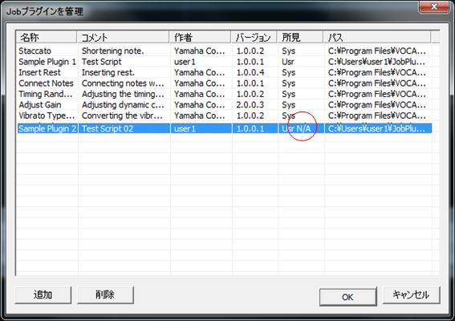

# Registration the Job plug-in and Modification of the Job plug-in scripts
## Registration of Job plug-in
"Job" of VOCALOID3 editor - By selecting> the menu, "Managing the Job Plug-in", dialog to manage the Job script plug-in opens. The dialog, the list of Job plug-in scripts that are currently registered will be displayed. From here, I can delete the registered Job plug-in script and add new Job plug-in script. You can press on the dialog "Add" button, you can add by file selection dialog appears, select the Job plug-in script file that you want to add here.

Here, I'll explain below an overview like any additional processing of the Job plug-in script, if it is done in VOCALOID3 within the editor.

First, load the Job plug-in a specified script file, you will get a plug-in manifest Job of the Job plug-in script. Then, only if it verifies the Job plug manifest acquired, it is determined to be a legitimate Job plug, register for Job plug library VOCALOID3 editor is managing. At this time, we calculate the SHA-1 hash code of the Job plug-in script file to register to Job plug-in library Te Align well.

Job plug-in script management dialog

## Modification of the Job plug-in scripts
VOCALOID3 editor, has been managed by the internal database will keep in Job plug-in library, information Job plug-in registered.

Then, if the SHA-1 hash code of the Job plug-in script file, which is calculated at the time of registration of the Job plug-in if you have changed by subsequent editing, security measures on, VOCALOID3 editor is performed as if "falsification of malicious" across the board it is based on the state that it can not.

In this case, marked as "N / A" will be put in the Job plug-in script management dialog box in the "findings" field, you can see that it is ready to the Job plug-in can not be executed by edited by this.

So, you need a procedure if you have modified the Job plug-in script after registering the Job plug-in, remove it from the Job plug-in script management dialog first, and to register again.

It should be noted that the deletion of the Job plug-in is done by a user to choose from a list of Job plug-in purposes from the Job script plug-in management dialog and press the "Delete" button.